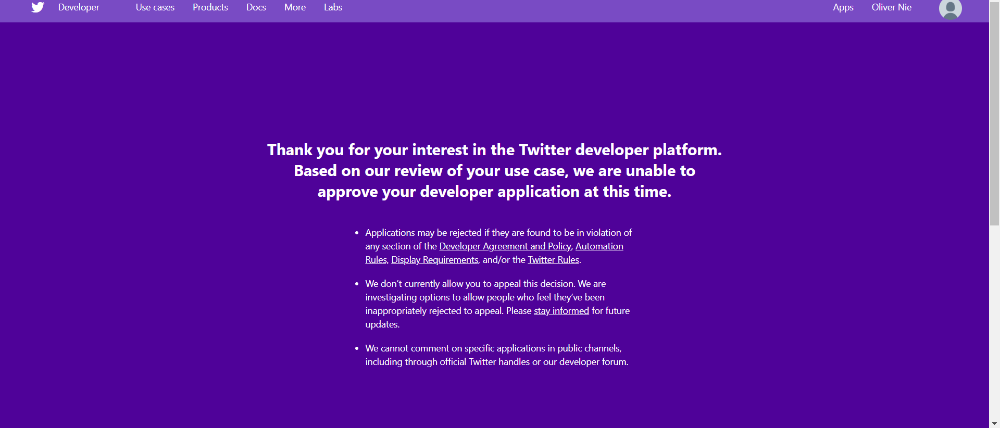

# Lab 2: Geo-tagged tweet collection and visualization

**Instructor:** Bo Zhao, 206.685.3846 or zhaobo@uw.edu
**Student:** Oliver Nie

In this practical exercise, we were going to use geo-tagged tweet from crawler
and the QGIS program. Originally, this geo-tagged data shall be collected by
Twitter API. However, I was personally banned/unable to obtain the API key and
API application from Twitter. Apparently, my twitter API application are found to
be in violation of the DAP or something wrong with my twitter application.

According to the sample data, we have collected data base on geo-tagged. Such a
dataset provides detailed longitude and latitude. Following the instruction, we are attempting to put all the sample data on the US map base on their geo locations. Those data represent user-tagged location with their tweets. Unfortunately, I am not able to remap or collect data due to the ban of API key. Thus, I decide to subit the alternative work --- recreate the tutorial.
